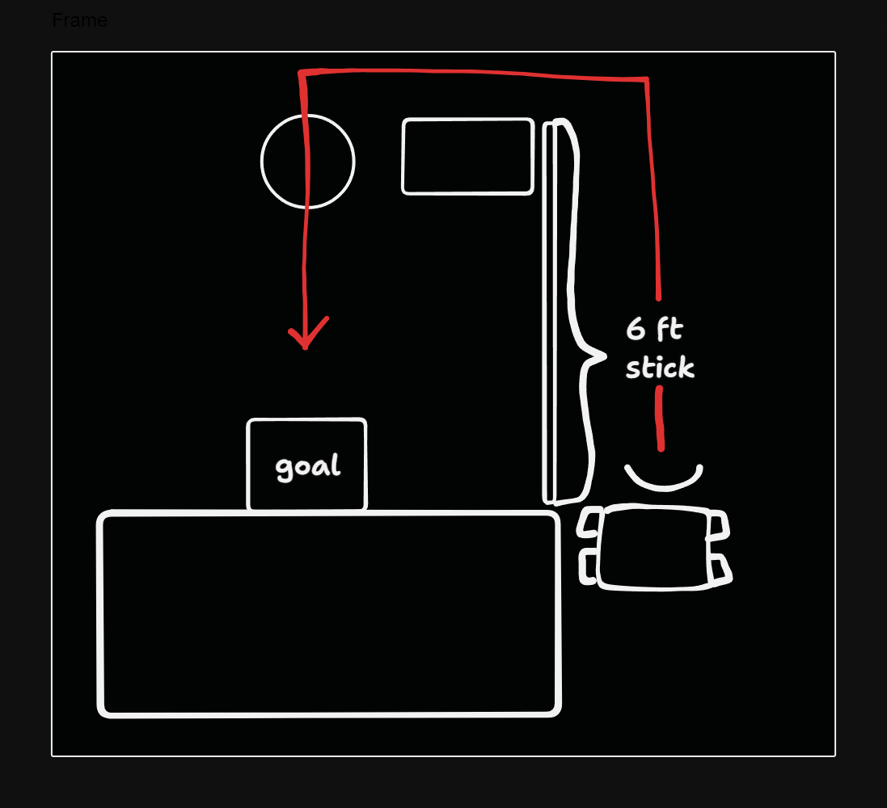

# Retrospective

Overall, the class went well but I had massively overestimated how fast the 
build process would take. Instead of taking the 2 hours that I had spent, it 
took ~5 hours for the first team to finish, ~8 hours for the other 2 teams to
finish their robot. We had a problem of the team that finished first having a 
massive ego-boost and becoming a distraction to others.

We only had the time to compete in one sport, robot soccer, but we had 
auxilliary challenges to teach programming and planning logic.

The biggest challenge that I had in this class was finding something for students
that had finished the primary task at hand to do so that they didn't bother the 
others. Initially I had wanted to ask them to help the other teams but their 
personalities don't mix well with the social dynamics of the other groups which
were already underutilizing their own team. Unless I was actively working with
the students, they would stop whatever challenged I had asked them to do to
horse around or they would achive the minimum then go back to messing around.

**Improvements to the curriculum:**
- make the students sign a "engineering contract" treating it like an internship
so that when students become troublesome, it's easier to handle
- create a better culture of coopertition by having the teams be more dynamic
  - caveat: since the build process took longer than I expected, it didn't make
  sense to remix teams before the robot was built if it would take so long to 
  modify the physical robot. If we had more time for the summer camp, this might
  be the solution.
  - the culture of coopertition was noticeably absent when asking the that was 
  finished on day 04 to help the other teams wire their servos.
- make a bigger differentiation between the different roles on the teams and 
implement them as "hats" with a rotational program so that they can all 
experience the different parts of robotics
- create a culture that encourages delegation / distribution of work

**Class demographics:**

For clarity, I'll estimate the language fluency of each student of each of the 
teams and the prior experience that they had (how many of my previous classes 
they've been to).

| Team | Sex | English Fluency  | Experience |
| ---  | --- | ---------------  | ---------- |
| 1    | F   | Bi-lingual fluent| CC         |
| 1    | F   | English fluent   | CC         |
| 1    | F   | Spanish only     | None       |
| 1    | M   | Spanish only     | None       |
| 2    | M   | Bi-lingual fluent| LRS        |
| 2    | M   | Bi-lingual fluent| LRS, LRM   |
| 2    | M   | ESL              | LRS, LRM   |
| 2    | M   | ESL              | LRC        |
| 3    | M   | English fluent   | LRSp       |
| 3    | M   | Bi-lingual fluent| LRS, LRM   |
| 3    | M   | Bi-lingual fluent| LRS        |

**Previous Classes**

| Acronym | Title                           | Duration  | Instruction Hours |
| ---     | -------------------------       | ---       | ---               |
| CC      | creative coding                 | 11 weeks  | 11hrs             |
| LRS     | lego robotics summer camp       | 5 days    | 10hrs             |
| LRM     | lego robotics class mindstorms  | 7 weeks   | 7hrs              |
| LRSp    | lego robotics class spike       | 21 days   | 21hrs             |

## Day 01

Summary:

The first day went well despite realizing that I didn't do a careful inventory 
of what equipment we had. Over half of the students were students that I had 
previously taught across LEGO robotics and creative coding. Interest was high 
in the class (20 / 60 students signed up) but we only had enough robot kits to 
reasonably fit 4 students per robot (12 students in the class).

The problem with the inventory was that we had 4 V5 controller kits, 2 V5 
clawbot kits + expansion packs, and 3 EDR clawbot kits (w/o EDR controller 
kits). What we ended up doing was giving one team a V5 kit + V5 controller, 
then two teams received a EDR kit + V5 controller. The idea was in case there 
was some incompatability with the V5 set, we could pivot to having 2 separate 
teams building out the 2 V5 kits. In hindsight I should've just had them all 
building the same kit and committed to a more equitable field.

- Team 1, 2 used the EDR + V5 controller kits
- Team 3 used to V5 kit + V5 controller kit 

We didn't end up doing the opening ceremony because I can get a little socially 
awkward some days and it seemed like the students were happy to be building 
their robots.

To incentivize the students to finish building faster, I let them drive the 
demo robot around. In my time as a FIRST robotics student, I remember that the 
driver would need more practice in order for the competition to go more smoothly.

Student accomplishments:
- students were attentative and kept each other in check
- students finished their flags
- students are vocal about when they run into problems and ask for help

Instructor wells:
- lots of interest in the class
- lots of returning students in the class
- good resolution to inventory problem
- introduced civil behavior rules
- writing rules in spanish + english
- using a "send up a representative" strategy, it allowed me to give more 
detailed instructions to a few people to then percolate down the other members

Improves:
- improper pre-class inventory check

## Day 02

Summary:

By the second day, the social dynamics of each group was much more apparent than
the first day. Most teams self-sorted roles such that at least half of each 
team discovered that there was an onboard servo controller on the main hub. 
This allowed them to get the servos running and stopping early on and 
potentially presented a safety hazard. The other half generally worked on 
building out the chassis.

Thankfully, there was still a great deal of novelty in the robotics kits and
there seemed to be ample amounts of work for everybody to do. The goal for this
day was to just build the driver base so that we could start playing 
robo-soccer sooner. For the teams with the EDR kits had to make a minor 
adjustment to the claw since the claw portion of the EDR kits came fully 
assembled with the EDR servo but the EDR servo kit was incompatible with the V5
 control hub so we had to swap out the EDR servo.

Since it seemed like most teams were making pretty good pacing, once I 
recognized that most teams weren't efficiently utilizing all their 
members I decided that it would be a good opportunity to start role 
specializations so I grabbed a few volunteers from each team to learn how to 
program the robot. *Notably I didn't explicitly assign roles to each team, rather
they were emergent or just charactizerizations of what each person did in a team.*

I was hoping that all teams would finish building their robots by the end of the
day and right after the build process is done, the next step is usually to 
program the robot. However, these V5 controller kits already had a few 
pre-programmed control schemes so it wasn't necessary to remap the controller.

Instead, I focused on setting autonomous challenges for the students. Rather 
than having them follow the built-in tutorials on the vr.vex.com, I set the 
following challenges:
- Move the robot from the bottom left corner to the top right corner
- Do the same thing but with fewer turns
- Move the robot from the top right and then back

At this stage, my goal was to teach them how to program so that they could then
teach their teammates how to program and do some role switching later on. This 
strategy seemed to have a promising start until the end of the day when I 
realize that team 01 had made very little progress. Even though the 
documentation they were following was language agnostic, they seemingly fiddled 
around with the pieces but didn't meaningfully assemble them. I didn't notice
that since team 02 and team 03 were much more vocal and I was bouncing between
them and the programmers.

Student accomplishments:
- at least one student from each team started coding
- students are still contributing to the robotics chassis

Wells:
- Introduced coding to the teams with a sub-team of each team
- Flag system made it easy to find the right robots
- Introduced safety rules for the robots

Improves:
- Needed to support teams more in parallelizing the build process / working together
- Needed to ask "mechanical leads" to share the building experience more
- Needed to take more pictures of the programming
- Should've challenged students to beat a specific time constraint or "beat my 
record" / something to encourage them to drive diagonally

## Day 03

Summary:

By day 03, the social dynamics of each group manifested more clearly as the 
novelty of the robots wore off and with it, their attention span. Even more 
interesting was observing the leadership dynamics form. There was an emergent 
leader of each team that was separate from the delegate that I spoke with on 
day 01. These were generally students that explicitly wanted to become engineers
but had trouble sharing the building experience with their team members. In 
team 01 the leader ended up being the bilingual student which makes sense given
she can actually communicate with the rest of the team.

There are always plenty of opportunities for delegation to occur in any build 
process but this wasn't facilitated explicitly in the build recipe that the 
students were following. I still haven't figured out a clean way to support 
splitting up the different parts of the build process but this is something I'm
looking forward to discovering.

On this day, the first team to finish their robot finished and became a bit of 
a menace to the rest of the students. This is where I faced the most personality
problems during the camp as they didn't have a productive way to let out their
energy or the attention span to continue working on the robot. In fact, most 
teams at this stage had at least 2 members that would hop on their phones or 
straight up nap. I did my best to get them to work on something or give them
a mini-challenge to focus on. Most of Day 03 and Day 04 were spent rotating
around to check-in on the distracted students or helping the focused ones
troubleshoot some physical problems and finding "missing parts." *In hindsight, 
it would've been better to incentivize teams to keep themselves on track.*

I had wanted to do a mini-challenge that the programmers would have to teach / 
work with their team for but I was worried about their pacing for finishing
their robots before the competition. At this stage, I was still hoping to 
finish the robot soccer by Day 04.

Student Accomplishments
- First robot was finished
- Teams are vocal when they get stuck instead of waiting around

Wells: 
- Recognizing unbalanced team dynamics
- Finding ways to re-engage students
- Finding ways to encourage the "leads" to share the work

Improves:
- Learn how to encourage teams to delegate / split / share the work by activity
design
  - teach them about bus factor through the activity
  - see if there's a self-governing way to do this
  - see if there's a place for "hats" of rotational roles

## Day 04

Summary:

For the most part, day 04 was very similar to day 03, it's just that the 
emphasis was on finishing the robots in time for the competition on Day 05. 
Particularly troubling was team 03 which had finished their robot first. The 
mechanical lead of this team had skipped the "supper" breaks that were an hour 
into the class to continue working on the robot which was cool to see but I
advised against it since nutrition and a mental break are key to avoiding burnout
and it seemed like he was romanticizing the "studious engineer" trope. 
Unfortunately this led to his pride taking over his personality in the coming
few days.

The way I tried to resolve this was by asking them to work on some autonomous 
modes. So I had brought a 6 foot stick and made a quick and dirty challenge
course to challenge them to program their robot to score the goal.

For the other teams that were struggling with sharing the work, I recommended
students take pictures of instructions a few pages ahead so they could 
parallelize the work better.

There was a great deal more shennanigans from the students as they started
throwing around the balls that were meant for the robot to play with. This is
where if I had fostered a culture of coopertition, it would've paid off more.

As the other teams came closer to finishing their robots, it came time to start
wiring up the servos to the control hub. There's a specific way to do this that
isn't detailed in the hub, unless you had the build manual for the V5 kit. So I
had to borrow the kit from the team that had finished and unfortunately, they 
were rather sassy responding with something to the effect of "why should I help
my opponents." I had a lecture that I began working on mentally but thankfully 
despite their sassiness they still gave up the wiring diagram.

Wells:

Improves:

---

- day 03 first robot finished
- practice driving it
- day 04 autonomous coding
- autonomous execution
- day 05 competition day
- remaining robots are finished